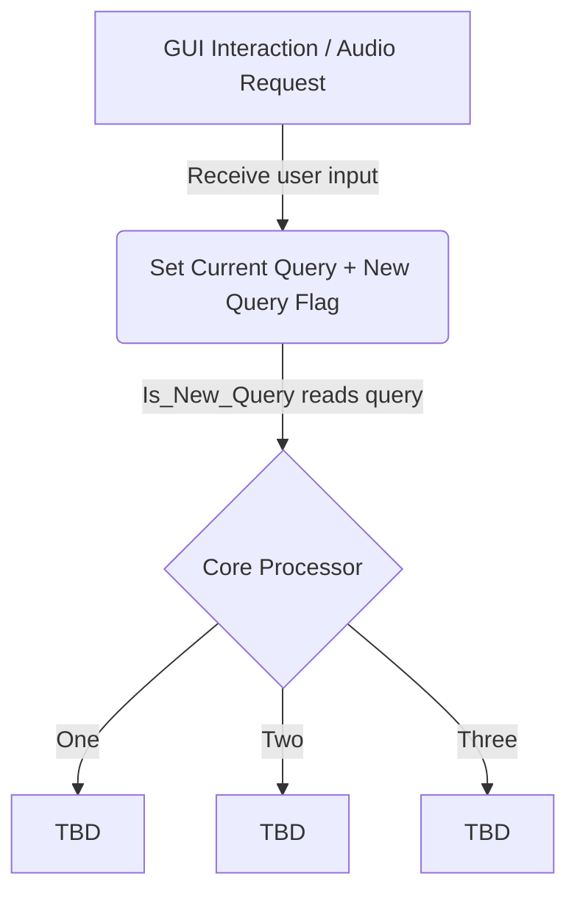

## Introduction

This file contains the high level overview of the command structure of the assistant. It details how the structure accepts queries and interacts with the other parts of the assistant.

## Flow Diagram

This diagram represents the flow of how the command structure is supposed to work. Initially, depending if the assistant is accepting audio or text queries, the command structure set the <SwmToken path="/command/config.py" pos="8:2:2" line-data="  &quot;currentQuery&quot;: &quot;&quot;,">`currentQuery`</SwmToken> variable and set the <SwmToken path="/command/config.py" pos="7:2:2" line-data="  &quot;newQueryAvailable&quot;: False,">`newQueryAvailable`</SwmToken> flag to true and will process them in <SwmToken path="/command/querying/Is_New_Query.py" pos="5:2:4" line-data="def Is_New_Query():">`Is_New_Query()`</SwmToken>. Then The core processor will send that query to the LLM and process the query.

The Core Processor currently is unimplemented and can be adapted to anything that needs to be done to interact with the LLM. Please update as you do so.

## Config Variables

- &nbsp;<SwmToken path="/command/config.py" pos="4:0:0" line-data="commandVariables = {">`commandVariables`</SwmToken>&nbsp;
  - <SwmToken path="/command/config.py" pos="5:2:2" line-data="  &quot;queryInputType&quot;: &quot;Audio&quot;,">`queryInputType`</SwmToken>: String, either "Text" or "Audio" to change input type
  - <SwmToken path="/command/config.py" pos="6:2:2" line-data="  &quot;activationKeyword&quot;: &quot;myra&quot;,">`activationKeyword`</SwmToken>: String, set to "myra" and must be a part of an audio query to process the query.
  - <SwmToken path="/command/config.py" pos="8:2:2" line-data="  &quot;currentQuery&quot;: &quot;&quot;,">`currentQuery`</SwmToken>: String, most recent query/holder for user query to be processed.
  - <SwmToken path="/command/querying/Is_New_Query.py" pos="24:6:6" line-data="        if commandVariables[&#39;newQueryAvailable&#39;] == False: return &quot;NONE&quot;">`newQueryAvailable`</SwmToken>: Boolean, set flag to true when a new query is set for <SwmToken path="/command/config.py" pos="8:2:2" line-data="  &quot;currentQuery&quot;: &quot;&quot;,">`currentQuery`</SwmToken> to process it. Automatically set to false in <SwmToken path="/command/querying/Is_New_Query.py" pos="5:2:4" line-data="def Is_New_Query():">`Is_New_Query()`</SwmToken>.
  - <SwmToken path="/command/config.py" pos="9:2:2" line-data="  &quot;isReprompt&quot;: False,">`isReprompt`</SwmToken>: Boolean, unused, to be used when tackling the issue of reprompting user for clarification.
- <SwmToken path="/command/config.py" pos="12:0:0" line-data="RESPONSE_SYSTEM_CONTEXT = &quot;You are a personal assistant. Answer any questions I have and help me with simple requests.&quot;">`RESPONSE_SYSTEM_CONTEXT`</SwmToken>: String, unused.

## 

<SwmMeta version="3.0.0" repo-id="Z2l0aHViJTNBJTNBUENBQSUzQSUzQUF2YWxvbkFjZQ==" repo-name="Myra">Powered by [Swimm](https://app.swimm.io/)</SwmMeta>
